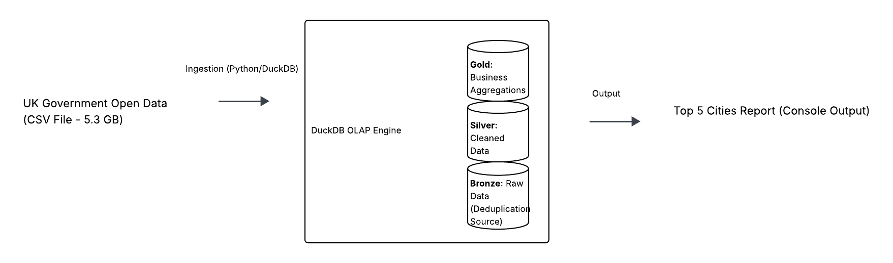
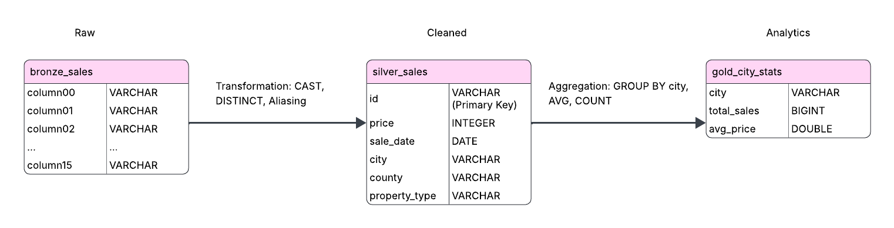
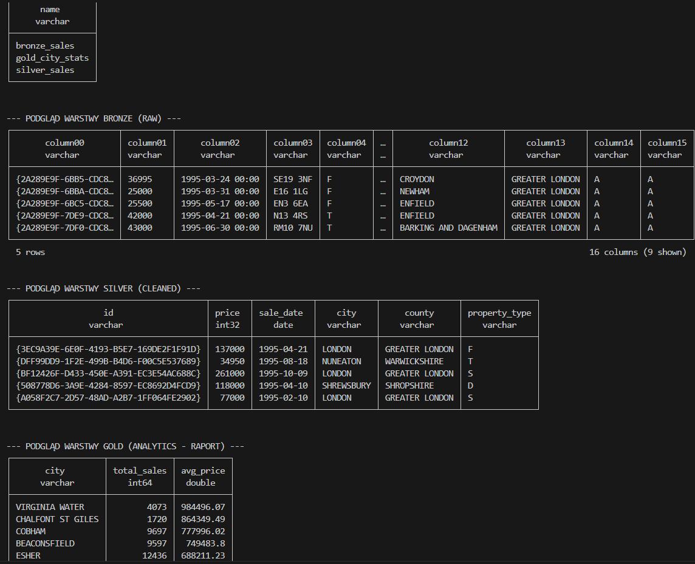

# Projekt ELT: Analiza Rynku Nieruchomości w UK

## Cel projektu
Celem projektu jest analiza brytyjskiego rynku nieruchomości w celu identyfikacji najdroższych lokalizacji oraz zbadania płynności rynku (liczba transakcji) na dużym zbiorze danych (Big Data). System ma za zadanie automatycznie wyczyścić surowe dane, usunąć duplikaty i przygotować raporty średnich cen dla poszczególnych miast.

## Architektura Systemu (High-Level)
Poniższy schemat przedstawia przepływ danych od źródła zewnętrznego (CSV), przez silnik DuckDB, aż po wynik końcowy.

## Opis warstw (Architektura medalionowa)

1. **Warstwa Bronze (Raw):** Zawiera surowe dane załadowane bezpośrednio z plików CSV. W celu przetestowania wydajności silnika oraz spełnienia wymogów projektowych, dane zostały zduplikowane (UNION ALL), co pozwoliło na pracę ze zbiorem o rozmiarze ~10.6 GB (62 mln rekordów).
2. **Warstwa Silver (Cleaned):** Dane oczyszczone i zdeduplikowane. Przeprowadzono rzutowanie typów danych (CAST) oraz mapowanie technicznych nazw kolumn na czytelne nazwy biznesowe.
3. **Warstwa Gold (Curated):** Tabela wynikowa zawierająca statystyki (średnia cena, liczba transakcji) w podziale na miasta.

## Struktura bazy danych (ERD)
Poniższy diagram przedstawia strukturę tabel oraz procesy transformacji zachodzące między warstwami.

## Identyfikacja problemów z jakością danych
W trakcie prac można było zauważyć trzy kluczowe problemy:
1. **Duplikaty:** Rozwiązane poprzez zastosowanie `DISTINCT` w warstwie Silver.
2. **Brak nazw kolumn:** Rozwiązane poprzez nadanie nazw poszczególnych kolumn.
3. **Niespójność formatów i typów dat:** Daty miały doklejone godziny (00:00), a ceny były traktowane jako zwykły tekst. Zamieniłam je na `DATE` i `INTEGER`.

## Weryfikacja i wyniki
Poniżej znajduje się podgląd tabel w bazie danych wygenerowany skryptem weryfikacyjnym:

## Specyfikacja techniczna
- **Silnik bazy danych:** DuckDB (In-process OLAP)
- **Środowisko:** Python 3.14 / VS Code
- **Kontrola wersji:** Git

## Instrukcja uruchomienia
1. Zainstalować DuckDB: `pip install duckdb`.
2. Pobierz dane źródłowe (ok. 5.3 GB):
   Uruchom skrypt: `python 01_pobieranie.py` (pobierze on plik `pp-complete.csv` z oficjalnych serwerów rządowych do folderu `data/raw/`).
3. Uruchomić główny proces: `python 02_elt_proces.py`.
4. (Opcjonalnie) Szybki podgląd tabel: `python 03_podglad.py`.