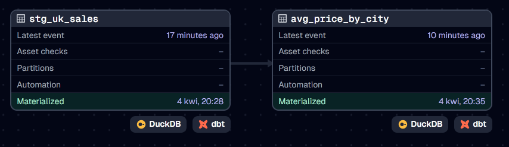
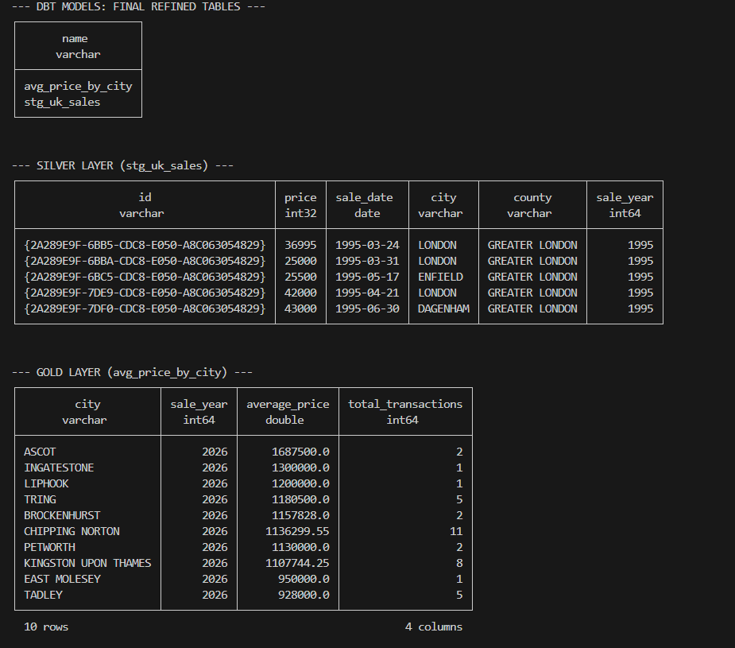
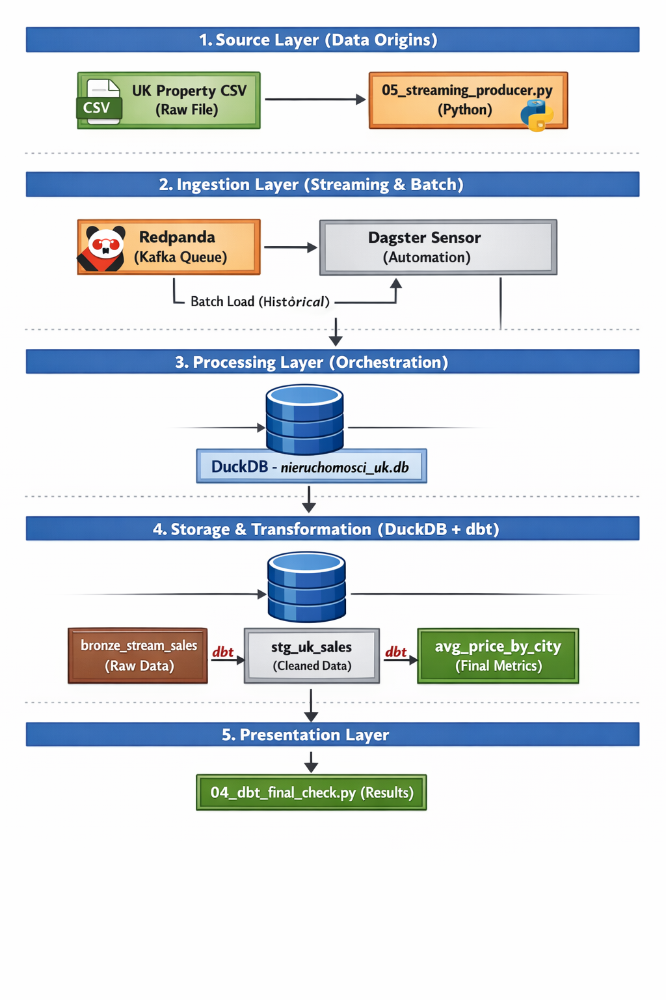

# Projekt ELT: Analiza Rynku Nieruchomości w UK

## Cel projektu
Celem projektu jest analiza brytyjskiego rynku nieruchomości w celu identyfikacji najdroższych lokalizacji oraz zbadania płynności rynku (liczba transakcji) na dużym zbiorze danych (Big Data). System ma za zadanie automatycznie wyczyścić surowe dane, usunąć duplikaty i przygotować raporty średnich cen dla poszczególnych miast.

## Architektura Systemu (High-Level)
Poniższy schemat przedstawia przepływ danych od źródła zewnętrznego (CSV), przez silnik DuckDB, aż po wynik końcowy.

## Opis warstw (Architektura medalionowa)

1. **Warstwa Bronze (Raw):** Zawiera surowe dane załadowane bezpośrednio z plików CSV. W celu przetestowania wydajności silnika oraz spełnienia wymogów projektowych, dane zostały zduplikowane (UNION ALL), co pozwoliło na pracę ze zbiorem o rozmiarze ~10.6 GB (62 mln rekordów).
2. **Warstwa Silver (Cleaned):** Dane oczyszczone i zdeduplikowane. Przeprowadzono rzutowanie typów danych (CAST) oraz mapowanie technicznych nazw kolumn na czytelne nazwy biznesowe.
3. **Warstwa Gold (Curated):** Tabela wynikowa zawierająca statystyki (średnia cena, liczba transakcji) w podziale na miasta.

## Struktura bazy danych (ERD)
Poniższy diagram przedstawia strukturę tabel oraz procesy transformacji zachodzące między warstwami.

## Identyfikacja problemów z jakością danych
W trakcie prac można było zauważyć trzy kluczowe problemy:
1. **Duplikaty:** Rozwiązane poprzez zastosowanie `DISTINCT` w warstwie Silver.
2. **Brak nazw kolumn:** Rozwiązane poprzez nadanie nazw poszczególnych kolumn.
3. **Niespójność formatów i typów dat:** Daty miały doklejone godziny (00:00), a ceny były traktowane jako zwykły tekst. Zamieniłam je na `DATE` i `INTEGER`.

## Weryfikacja i wyniki
Poniżej znajduje się podgląd tabel w bazie danych wygenerowany skryptem weryfikacyjnym:

## Specyfikacja techniczna
- **Silnik bazy danych:** DuckDB (In-process OLAP)
- **Środowisko:** Python 3.14 / VS Code
- **Kontrola wersji:** Git

## Instrukcja uruchomienia
1. Zainstalować DuckDB: `pip install duckdb`.
2. Pobierz dane źródłowe (ok. 5.3 GB):
   Uruchom skrypt: `python 01_pobieranie.py` (pobierze on plik `pp-complete.csv` z oficjalnych serwerów rządowych do folderu `data/raw/`).
3. Uruchomić główny proces: `python 02_elt_proces.py`.
4. (Opcjonalnie) Szybki podgląd tabel: `python 03_podglad.py`.

## English version
Getting Started:
1. Install dependencies: `pip install duckdb`
2. Download source data (~5.3 GB): `python 01_pobieranie.py`
3. Run the ELT pipeline: `python 02_elt_proces.py`
4. (Optional) Preview results: `python 03_podglad.py`

# Orkiestracja i Modern Data Stack (Faza 2)

W drugiej fazie projektu wdrożono nowoczesną architekturę potoku danych (Data Pipeline) opartą na orkiestracji procesów oraz deklaratywnym podejściu do transformacji SQL.

## Charakterystyka wdrożonych narzędzi
- **Dagster (Orchestrator):** Zarządzanie cyklem życia danych, monitorowanie zależności (lineage) oraz automatyzacja procesów.
- **dbt (Transformation Tool):** Narzędzie do modelowania danych w warstwie SQL, umożliwiające wersjonowanie logiki biznesowej i automatyczną dokumentację.
- **DuckDB (Execution Engine):** Silnik analityczny odpowiedzialny za wydajne przetwarzanie danych wewnątrz bazy (In-process OLAP).

## Architektura potoku danych (Lineage Diagram)
Poniższy schemat przedstawia graf zależności między modelami dbt zarządzany przez orkiestratora Dagster. Zapewnia on przejrzystość przepływu danych od warstwy surowej (Silver Staging) do warstwy analitycznej (Gold).

## Warstwy transformacji dbt
Logika biznesowa została przeniesiona do dbt i podzielona na dwa kluczowe etapy:
1. **Model stg_uk_sales (Silver):** Odpowiedzialny za pobieranie partycjonowanych plików CSV z lokalnego systemu plików, rzutowanie typów danych oraz standaryzację nazw kolumn.
2. **Model avg_price_by_city (Gold):** Model agregujący, wyliczający średnie ceny nieruchomości oraz liczbę transakcji w podziale na miasta i lata sprzedaży.

## Podgląd wyników (Data Preview)
Poniżej przedstawiono zrzut ekranu zawierający fragmenty wygenerowanych danych z obu kluczowych warstw systemu (Silver oraz Gold). Pozwala to na natychmiastową weryfikację poprawności transformacji, rzutowania typów oraz końcowych agregacji analitycznych.

### Podgląd warstw Staging (stg_uk_sales) oraz Analytics (avg_price_by_city)
Górna część tabeli prezentuje oczyszczone dane transakcyjne z poprawnie zmapowanymi nazwami kolumn. Dolna część przedstawia ostateczny raport średnich cen nieruchomości w podziale na miasta i lata sprzedaży.

## Idempotentność i utrzymanie systemu
Zastosowane podejście gwarantuje pełną idempotentność procesów – każde ponowne uruchomienie materializacji w Dagsterze odświeża stan tabel bez ryzyka duplikacji danych. Dzięki zastosowaniu dbt, system jest łatwo skalowalny i przystosowany do pracy zespołowej (wersjonowanie kodu, modularność).

## Instrukcja uruchomienia (Faza 2)
1. Aktywacja środowiska wirtualnego: `.\venv\Scripts\activate`.
2. Instalacja zależności: `pip install -r requirements.txt`.
3. Uruchomienie interfejsu Dagster: `dagster dev -f orchestration/definitions.py`
4. Dostęp do interfejsu pod adresem http://localhost:3000. W zakładce Lineage należy wybrać opcję "Materialize all" w celu uruchomienia potoku.
5. Weryfikacja końcowa za pomocą skryptu: `python 04_dbt_final_check.py`.

## English version (Phase 2)
1. Activate venv: `.\venv\Scripts\activate`
2. Install dependencies: `pip install -r requirements.txt`
3. Launch orchestrator: `dagster dev -f orchestration/definitions.py`
4. Access UI at http://localhost:3000, navigate to Lineage and click "Materialize all".
5. Run final verification: `python 04_dbt_final_check.py`
    
# Przetwarzanie strumieniowe i system kolejek (Faza 3)

W trzeciej fazie projekt został rozbudowany o **architekturę hybrydową (Lambda)**, która pozwala na jednoczesne przetwarzanie dużych partii danych historycznych (Batch) oraz nowych transakcji spływających w czasie rzeczywistym (Streaming).

## Nowoczesna Architektura Strumieniowa
Wprowadzono system kolejkowania wiadomości, który oddziela źródło danych od bazy docelowej, zapewniając odporność systemu na awarie i skalowalność.

## Mechanizm działania
1. **Producer:** Skrypt `scripts/05_streaming_producer.py` czyta dane i wysyła je do tematu `uk_property_sales` w Redpandzie.
2. **Sensor:** Dagster co 30 sekund sprawdza kolejkę. Jeśli znajdzie dane, uruchamia asset `raw_stream_ingestion`.
3. **Storage:** Dane trafiają do tabeli `bronze_stream_sales` w DuckDB, skąd mogą być dalej przetwarzane przez modele dbt.

## Instrukcja uruchomienia (Faza 3)
1. Upewnij się, że **Docker Desktop** jest uruchomiony.
2. Uruchom infrastrukturę Redpanda: `docker-compose up -d`.
3. Aktywuj środowisko: `.\venv\Scripts\activate`.
4. Uruchom symulator danych (Producer): `python scripts/05_streaming_producer.py`.
5. W osobnym terminalu uruchom Dagstera: `dagster dev -f orchestration/definitions.py`.
6. W interfejsie Dagstera (Automation) włącz sensor `redpanda_message_sensor`. Od tego momentu dane będą ładowane automatycznie.

## English version (Phase 3)
1. Ensure **Docker Desktop** is running.
2. Start Redpanda infrastructure: `docker-compose up -d`.
3. Activate venv: `.\venv\Scripts\activate`.
4. Start the Data Simulator: `python scripts/05_streaming_producer.py`.
5. In a separate terminal, launch Dagster: `dagster dev -f orchestration/definitions.py`.
6. In the Dagster UI (Automation tab), toggle the `redpanda_message_sensor` to **On**. Data will now be ingested automatically.